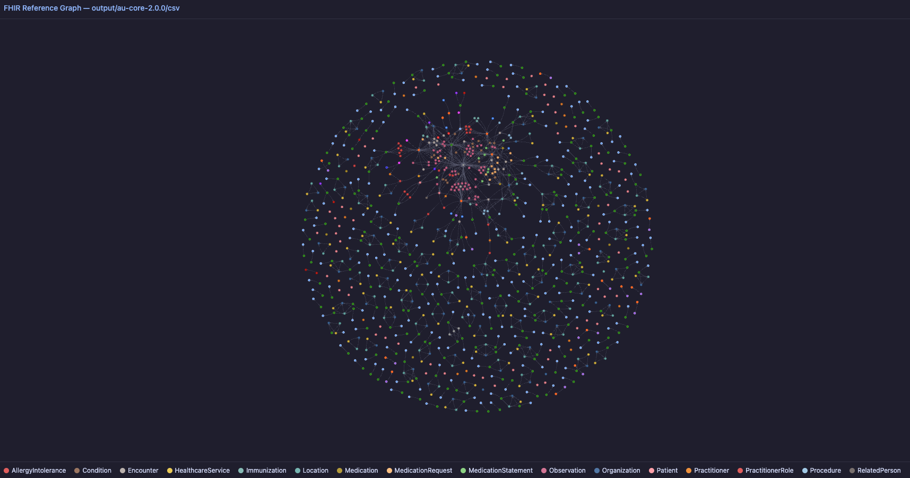

# fhirviz

Interactive reference graph visualiser for FHIR resources.

Reads a directory of `.ndjson` or `.json` FHIR files and renders a force-directed network of resource references as a single self-contained HTML file.



## Usage

```sh
python3 fhirviz.py --dir path/to/fhir/files
```

The graph is written to `graph.html` inside the same directory. Open it in any browser.

## Input formats

- **NDJSON** — one resource per line (`.ndjson`)
- **JSON** — single resource or FHIR Bundle (`.json`)

Both formats can coexist in the same directory.

## CLI

`--dir`
Required. Path to the directory containing FHIR output files.


## Requirements

Python 3. 

## License

This project is licensed under the Apache License 2.0 - see the [LICENSE](LICENSE) file for details.

---

**Made with ❤️ for the FHIR community**